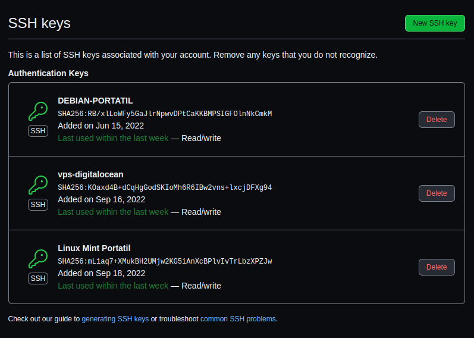
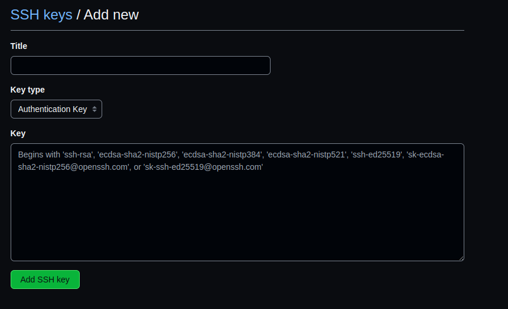

# Configuraciones de Git

## Configuraciones en GitHub

### Generación de claves SSH

En primer lugar creamos un par de claves con el comando:

```
ssh-keygen
```
Con esto generamos el archivo *id_rsa* y *id_rsa.pub* que contienen respectivamente nuestra clave privada y clave pública.

Para poder conectarnos a GitHub mediante SSH lo que tenemos que hacer es:

``` 
cat .ssh/id_rsa.pub
```
y con la salida de este comando copiar su contenido. Una vez tenemos la clave copiada, vamos a nuestra configuración de usuario en github entrando [a este link](https://github.com/settings/profile) y accediendo a la sección de *Claves SSH y GPG*.

### Guardado de claves en GitHub

En la siguiente imagen se puede ver la página que nos interesa, donde podremos añadir una nueva clave SSH:



Para poder añadir una nueva clave, le damos al botón de nueva clave SSH, lo cual accederá a la siguiente pantalla:



Aquí simplemente le ponemos un nombre a nuestra clave para saber a qué equipo se refiere dicha clave y debajo le pegamos la configuración que acabamos de copiar de nuestra clave SSH.


## Configuración de correo y nombre para los commit
En nuestro equipo tenemos que ejecutar los dos siguientes comandos:

```
git config --global user.name "Nombre Apellido1 Apellido2"
git config --global user.email "example@email.com"
```

Poniendo nuestros datos entre las comillas. Una vez hemos hecho eso, podemos comprobar que se han realizado bien las configuraciones ejecutando el comando:

```
git config --global --list
```

Y esto nos proporciona el siguiente resultado:

